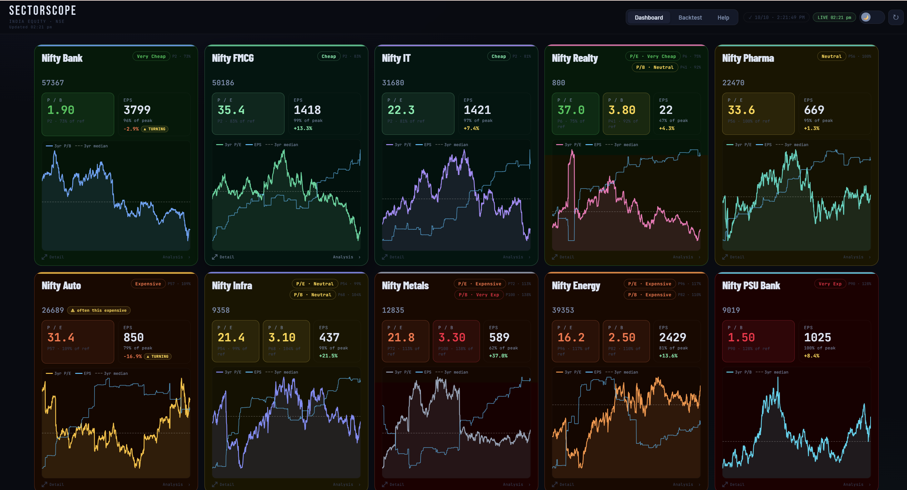

# SectorScope

A visual dashboard for spotting under- and over-valued Indian sectors, using P/E and P/B against weighted historical medians.

[](https://opensource.org/licenses/MIT)
[](https://ungeeked.github.io/sectorscope/)
[](#quick-start)
[](https://www.nseindia.com/)

**🔗 Live demo:** https://ungeeked.github.io/sectorscope/

---

## Screenshot

<!-- Capture at ~1400px wide, dashboard page, green card near top, showing mix of single- and dual-metric cards. -->

[](https://github.com/ungeeked/SectorScope/blob/main/assets/screenshot.png)

---

## What it does

This tool answers one question: **which Indian sectors are attractively priced right now, relative to their own history?**

It doesn't pick stocks. It ranks 10 NSE sectoral indices (Bank, PSU Bank, IT, Auto, FMCG, Pharma, Infra, Realty, Energy, Metals) from cheapest to most expensive, measured against each sector's own 3-year / 5-year / 10-year median valuation. Green cards float to the top; red cards sink to the bottom. Every card has a flip-over with the detailed breakdown, a dedicated sector-detail overlay with quarterly data and EPS growth charts, and a separate Backtest page that shows every past time the sector was at today's valuation level and what happened to prices 6 months and 1 year later.

---

## Features

- **Valuation bands** — Very Cheap / Cheap / Neutral / Expensive / Very Expensive, derived from each sector's current value as a percentage of its own weighted historical median (30% × 3yr + 60% × 5yr + 10% × 10yr).
- **Per-sector metric selection** — P/E-only (IT, Auto, FMCG, Pharma), P/B-only (Bank, PSU Bank), or both (Infra, Realty, Energy, Metals) — chosen automatically based on which lens is most reliable for that sector.
- **Two signals per card** — percentile rank inside the 5-year distribution (how unusual is today?) alongside % of weighted reference (how far from the anchor?). A divergence capsule appears when the two disagree.
- **EPS momentum** — year-on-year growth, % of all-time peak, and a "turning" flag when trailing quarterly EPS recovers from a negative YoY.
- **Sparkline per card** — 3 years of P/E or P/B daily values with the 3-year median as a dashed reference line.
- **Detail overlay** — per sector: current snapshot, historical medians with bar visualisation, annual + quarterly EPS growth charts, and a last-5-years quarterly averages table.
- **Backtest page** — for any sector and any date range, find every historical instance where the sector hit a specific valuation threshold, and show the forward 6-month and 1-year CAGR that followed.
- **Live intraday feed** — prices and P/E refresh every 20 minutes during market hours; overlays onto the historical data automatically.
- **Dark / light themes** — theme preference persisted across sessions.
- **Keyboard accessible** — Tab to focus a card, Enter/Space to flip, Esc to close overlays.

---

## Quick start

The entire front-end is one static HTML file. No build, no dependencies, no server required.

> **Note:** Live data requires your own Cloudflare Worker and Google Apps Script endpoints (see [Data pipeline](#data-pipeline) below). Without them, the dashboard loads but shows no data.

### Run locally

```bash
git clone https://github.com/ungeeked/sectorscope.git
cd sectorscope
# Open index.html directly in a browser — works via file:// for most browsers.
# Or serve it if your browser restricts local fetch:
python3 -m http.server 8000
# → open http://localhost:8000
```

### Deploy to GitHub Pages

1. Push to a repo (public or private on a paid plan).
2. **Settings** → **Pages** → Source: **Deploy from a branch** → Branch: `main`, folder: `/ (root)`.
3. Wait ~30 seconds. Your dashboard is live at `https://<user>.github.io/<repo>/`.

That's it. No GitHub Actions, no build step.

---

## How it works

### Valuation bands

Each sector has its own history, so "cheap" is defined relative to that history rather than an absolute threshold.

| Band | Current value as % of weighted ref |
|---|---|
| Very Cheap | ≤ 80% |
| Cheap | 80–90% |
| Neutral | 90–105% |
| Expensive | 105–120% |
| Very Expensive | > 120% |

The Neutral band is intentionally asymmetric (90–105%, not 95–105%) because sectors tend to trade slightly above their own long-run median — positive drift from earnings growth over time.

### Weighted reference

Each sector's anchor is:

```
Weighted Ref = 0.30 × median(3yr) + 0.60 × median(5yr) + 0.10 × median(10yr)
```

5-year gets the most weight because it captures a full economic cycle while still reflecting the current regime. The 10-year window is a small sanity check against very long-run averages. If a window is missing (e.g. a younger index), its weight is redistributed proportionally.

All medians are computed on **winsorised** series (clipped at 1st and 99th percentile) so a single bad tick on a thin-liquidity day doesn't skew the reference.

---

## Data pipeline

The live data flow is:

```
NSE / Google Sheets  →  Google Apps Script  →  Cloudflare Worker  →  index.html
```

### Why a Cloudflare Worker?

Google Apps Script endpoints require CORS headers and can expose your Google account URLs publicly. The Cloudflare Worker sits in between to:

- Add the necessary `Access-Control-Allow-Origin` headers so the browser can fetch from the dashboard.
- Keep your Apps Script URLs private — only the Worker URL is embedded in `index.html`.
- Optionally cache responses at the edge to stay within Apps Script quotas.

### What's not in this repo

The Cloudflare Worker code and the Google Apps Script + Sheets backing the data are **not included** in this open-source release — they are tied to private Google accounts and proprietary NSE data pipelines. This means **the live demo endpoints in the source will not work if you fork the repo.**

### Setting up your own pipeline

To run the dashboard with live data on your own fork:

1. **Google Sheets + Apps Script** — Create a Sheet with NSE bhavcopy data (columns: `date`, `price`, `pe`, `pb`, `eps`). Publish a Google Apps Script Web App that returns this data as JSON. The expected response format is documented inline in the `normalise()` function in `index.html`.

2. **Cloudflare Worker** — Create a free Cloudflare Workers account. Write a Worker that fetches from your Apps Script URL and returns the response with `Access-Control-Allow-Origin: *`. Deploy it and copy the `*.workers.dev` URL.

3. **Wire it up** — In `index.html`, replace the endpoint URLs in the `SECTORS` config array with your own Cloudflare Worker URLs. There is one endpoint per sector plus one consolidated live feed endpoint.

---

## Project structure

```
.
├── index.html         — The entire application (HTML + CSS + vanilla JS)
├── assets/
│   └── screenshot.png — Dashboard screenshot (add your own)
├── README.md
└── LICENSE
```

One file. No framework, no bundler, no npm. If you want to modify it, open `index.html` in your editor of choice.

---

## Roadmap

- [x] Dashboard with 10 sectors, dual-metric support, live feed
- [x] Backtest page with historical trigger + forward-return analysis
- [x] Sector detail overlay with EPS growth charts
- [x] Keyboard accessibility
- [ ] Additional sectors (Nifty 50, Nifty Next 50, mid/small-cap indices)
- [ ] Saved watchlist / custom sector grouping
- [ ] Sparkline colour handling via CSS variables (eliminates full card re-render on theme toggle)
- [ ] Rolling-median optimisation in backtest inner loop (binary-indexed tree for O(log n) updates)
- [ ] Export card data as CSV

---

## Contributing

Issues and pull requests are welcome. For bigger changes, please open an issue first to discuss the direction.

If you find a calculation bug or a UI glitch, a screenshot and the sector name it reproduces on is usually enough to repro.

---

## License

[MIT](LICENSE) © Prashant Gupta

The MIT license covers the **code** in this repository (`index.html`, and any supporting files committed here). It does not cover the Cloudflare Worker, the Google Apps Script, or the underlying market data — those are not part of this release. Data sourced from NSE is subject to NSE's own terms of use.

---

## Disclaimer

This tool is for **educational and research purposes only**. It is not investment advice. Valuation signals are one input among many — cheap sectors can get cheaper, and expensive sectors can keep running. Always do your own research and consider consulting a registered financial advisor before making investment decisions.
